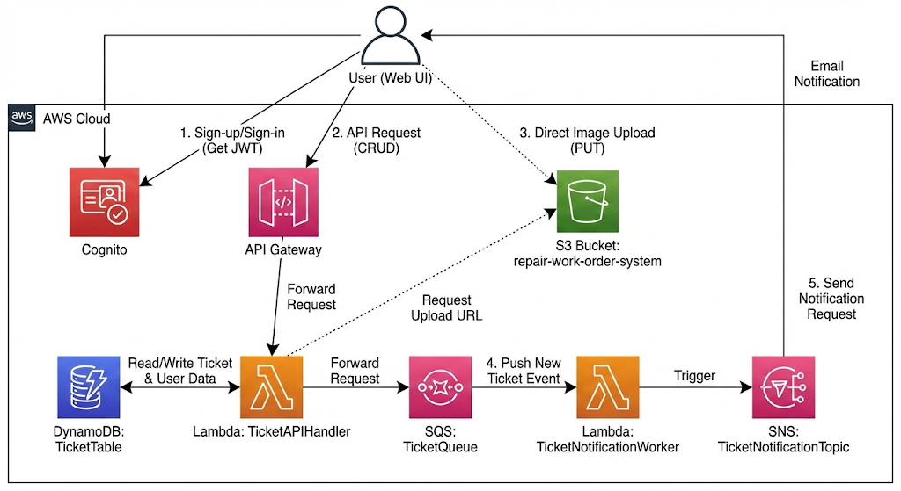
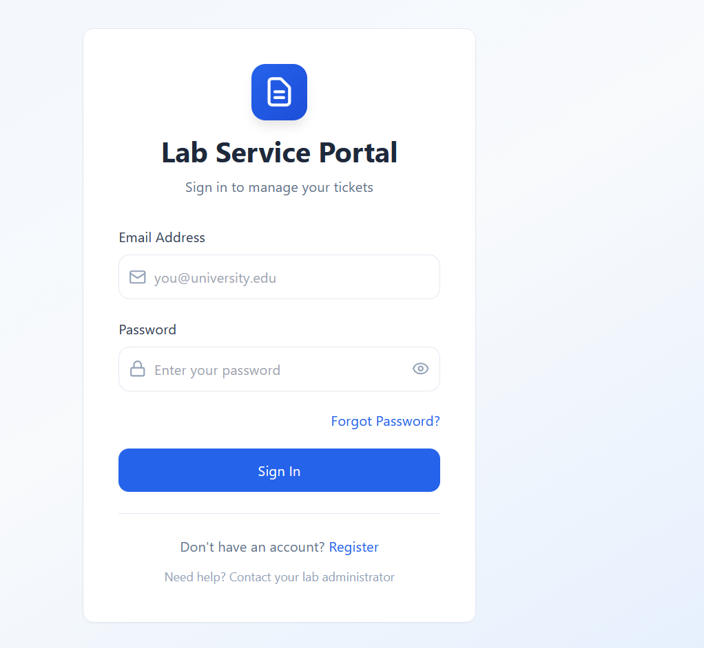
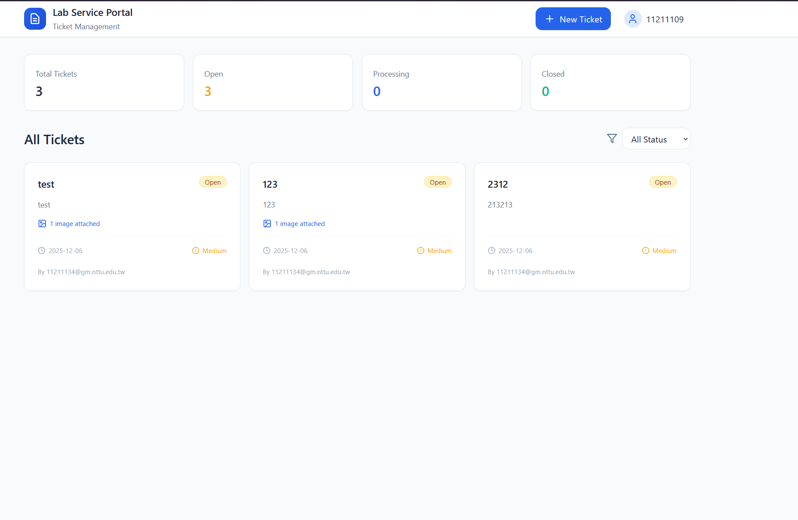
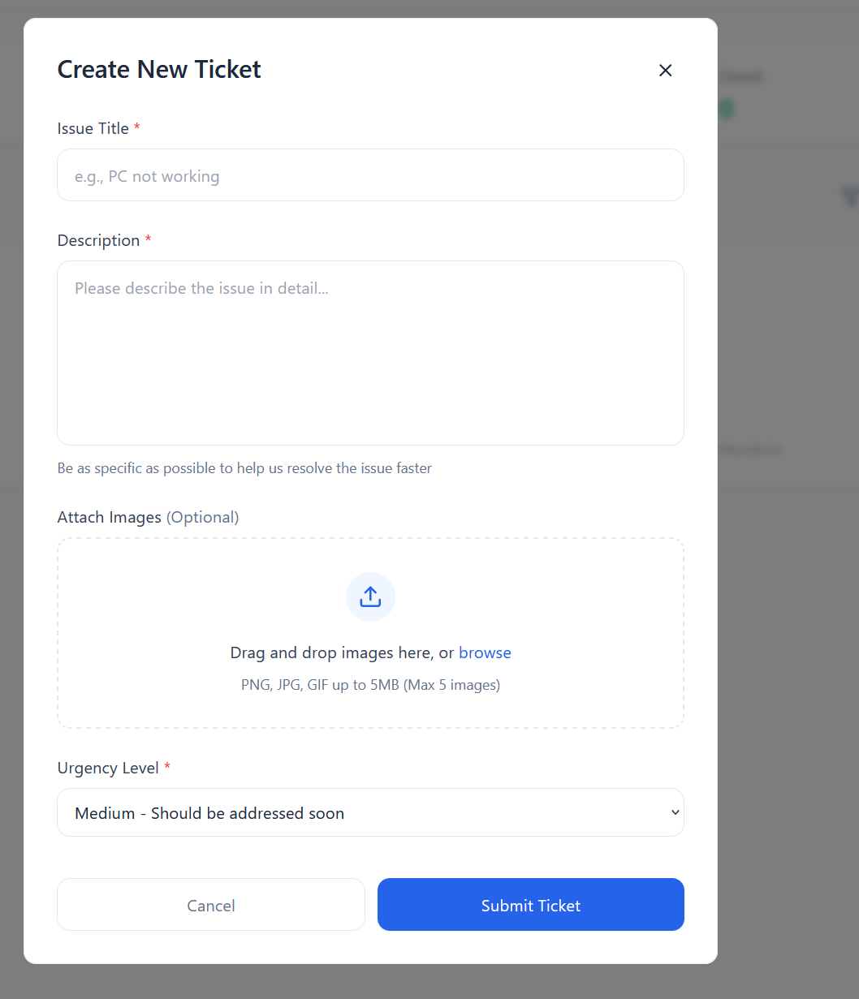
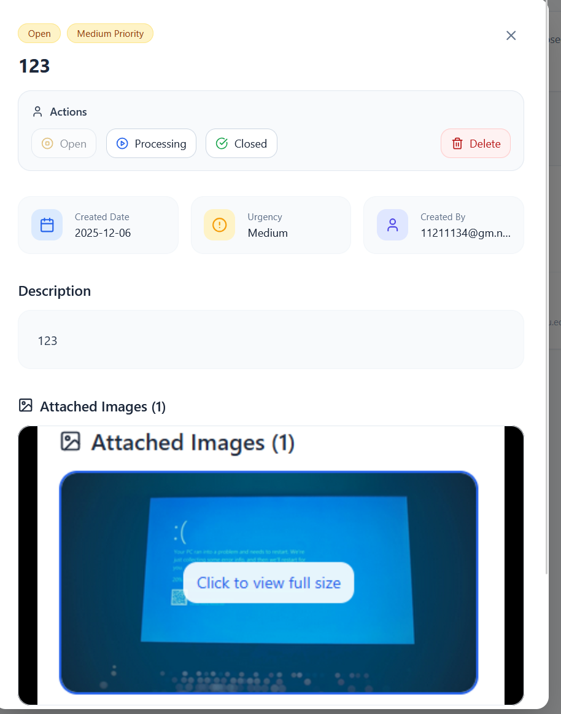

# Lab Service Portal - 維修工單系統

AWS 雲端運算課程期末專案

## 專案簡介

維修工單管理系統，提供學生報修與管理員處理工單的完整流程。採用 Serverless 架構，整合 AWS 多項服務實現高可用性與自動化通知。

---

## 系統架構



### 使用工具

**Frontend**
- React 19 + TypeScript
- Vite (建置工具)
- Tailwind CSS (樣式框架)
- AWS Amplify (認證整合)

**Backend**
- AWS Lambda (Python 3.x)
- API Gateway (REST API)
- DynamoDB (NoSQL 資料庫)
- S3 (圖片儲存)
- SQS (訊息佇列)
- SNS (Email 通知)
- Cognito (使用者認證)

---

## 主要功能

### 使用者功能
- ✅ 帳號註冊與登入 (AWS Cognito)
- ✅ 建立維修工單
- ✅ 上傳故障圖片 (拖放/選擇檔案)
- ✅ 查看所有工單
- ✅ 刪除自己的工單
- ✅ 即時狀態更新

### 管理員功能
- ✅ 查看所有工單
- ✅ 更新工單狀態 (Open → Processing → Closed)
- ✅ 刪除任何工單
- ✅ 統計資訊總覽

### 自動化通知
- 📧 建立工單時自動發送 Email 通知
- 🔔 透過 SQS + SNS 實現非同步處理

---

## 系統畫面

### 登入頁面


### 註冊頁面


### 主控台


### 建立工單


### 工單管理


---

## 快速開始

### 前置需求
- Node.js 18+
- AWS 帳號
- Python 3.12

### 1. 安裝前端

```bash
cd src
npm install
```

### 2. 配置 AWS

#### Cognito 設定
編輯 `src/config/aws-config.ts`:
```typescript
export const awsConfig = {
  userPoolId: 'YOUR_USER_POOL_ID',
  userPoolClientId: 'YOUR_CLIENT_ID',
  region: 'us-east-1'
};
```

#### API Gateway 設定
編輯 `src/config/api.ts`:
```typescript
export const API_BASE_URL = 'YOUR_API_GATEWAY_URL';
```

#### Lambda 設定
編輯 `api/TicketAPIHandler.py`:
```python
SQS_QUEUE_URL = 'YOUR_SQS_URL'
TABLE_NAME = 'TicketTable'
S3_BUCKET_NAME = 'YOUR_BUCKET_NAME'
```

編輯 `api/TicketNotificationWorker.py`:
```python
SNS_TOPIC_ARN = 'YOUR_SNS_ARN'
```

### 3. 部署 AWS 服務

#### 建立 DynamoDB Table
```bash
Table Name: TicketTable
Partition Key: ticket_id (String)
```

#### 建立 S3 Bucket
```bash
Bucket Name: repair-work-order-system
Public Access: 關閉 (使用 Pre-signed URL)
```

#### 部署 Lambda Functions
1. `TicketAPIHandler` - 主要 API 處理
2. `TicketNotificationWorker` - SQS 觸發的通知處理

#### 設定 API Gateway
- 建立 REST API
- 設定路由: `/tickets`, `/tickets/{id}`
- 啟用 CORS
- 整合 Lambda Authorizer (選用)

#### 建立 SQS Queue
```bash
Queue Name: TicketQueue
Type: Standard
```

#### 建立 SNS Topic
```bash
Topic Name: TicketNotificationTopic
訂閱: Email
```

#### 設定 Cognito
```bash
User Pool: repair-work-order-system
App Client: Web Client
Groups: Admin, User
```

### 4. 啟動專案

```bash
# 開發環境
npm run dev

# 建置
npm run build
```

---

## 專案結構

```
Repair_Work_Order_System/
├── api/
│   ├── TicketAPIHandler.py          # 主 API Lambda
│   ├── TicketNotificationWorker.py  # 通知 Worker
│   └── api_example.py               # API 測試範例
├── src/
│   ├── components/                  # React 組件
│   │   ├── LoginPage.tsx
│   │   ├── RegisterPage.tsx
│   │   ├── Dashboard.tsx
│   │   ├── TicketCard.tsx
│   │   ├── CreateTicketModal.tsx
│   │   └── TicketDetailModal.tsx
│   ├── config/                      # 配置檔
│   │   ├── api.ts
│   │   └── aws-config.ts
│   ├── services/                    # API 服務層
│   │   └── ticketService.ts
│   └── App.tsx                      # 主應用
├── doc/
│   ├── api_doc.md                   # API 文件
│   ├── webui_doc.md                 # Web UI 文件
│   └── json_doc.md                  # JSON 格式說明
├── picture/                         # 系統截圖
└── README.md
```

---

## API 文件

詳細 API 說明請參考: [API 文件](doc/api_doc.md)

### 主要端點

```http
# 使用者
POST   /tickets          # 註冊/登入 (action: register/login)
GET    /tickets          # 查詢所有工單
POST   /tickets          # 建立工單
PUT    /tickets/{id}     # 更新工單狀態 (Admin)
DELETE /tickets/{id}     # 刪除工單

# 圖片上傳
POST   /tickets          # 取得 S3 上傳 URL (action: get_upload_url)
```

---

## 資料庫結構

### DynamoDB: TicketTable

| 欄位        | 型別   | 說明                   |
| ----------- | ------ | ---------------------- |
| ticket_id   | String | Partition Key (UUID)   |
| type        | String | "ticket" 或 "user"     |
| title       | String | 工單標題               |
| description | String | 詳細說明               |
| priority    | String | Low/Medium/High        |
| status      | String | Open/Processing/Closed |
| user_email  | String | 報告者 Email           |
| user_name   | String | 報告者姓名             |
| images      | List   | 圖片 URL 陣列          |
| created_at  | String | ISO 8601 時間戳        |

---

## 權限設計

### User (一般使用者)
- 查看所有工單
- 建立新工單
- 刪除自己的工單

### Admin (管理員)
- User 所有權限
- 更新任何工單狀態
- 刪除任何工單

**權限判斷**: JWT Token 的 `cognito:groups` 欄位


---

## 開發團隊
- 組長:  
  - 姓名: 謝尚哲  
  - 學號: 11211109  
- 組員:  
  - 姓名: 鍾承翰  
  - 學號: 11211134  

